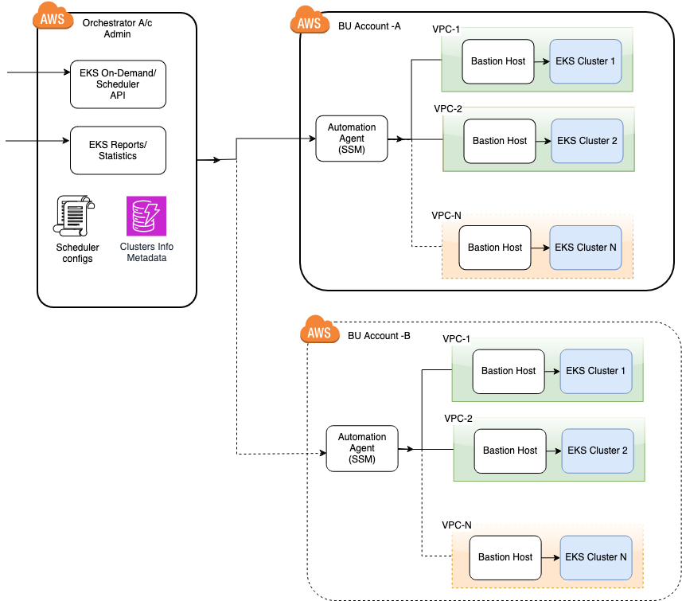
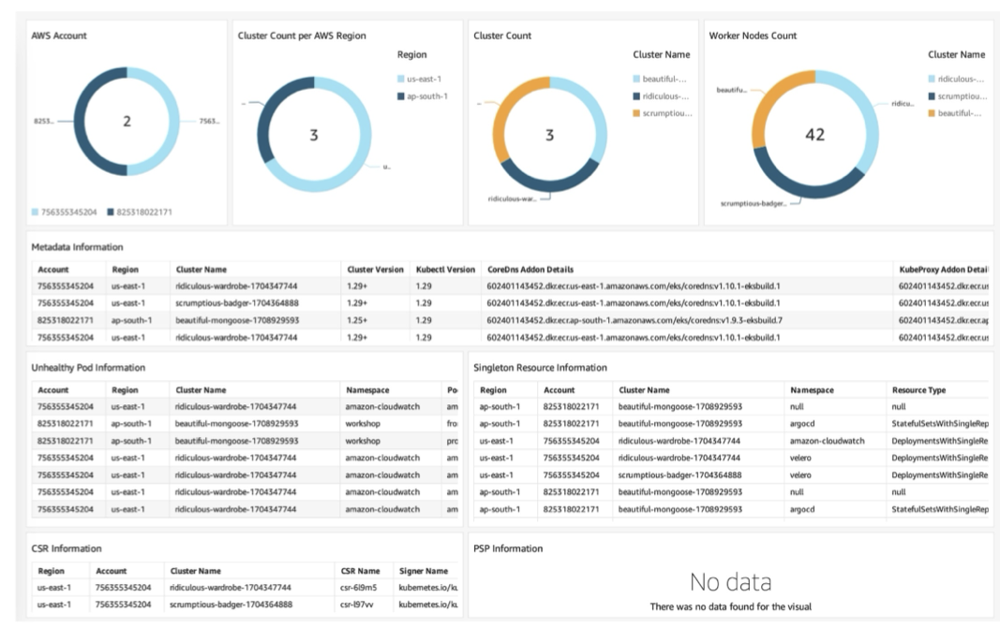
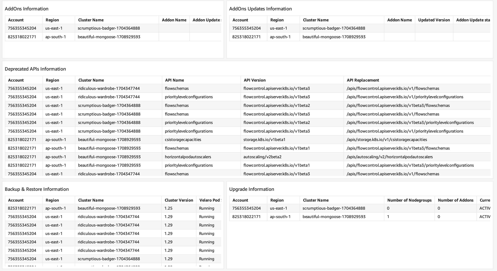
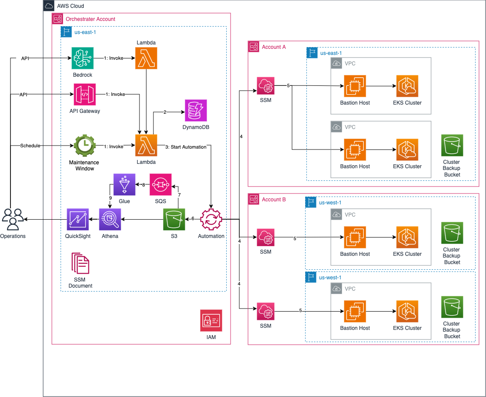

# EKS Management On Scale

Distributing workloads across multiple EKS clusters in different AWS accounts and regions is a common practice for availability, redundancy, and risk mitigation.
However, managing numerous clusters creates operational challenges around standards, regulations, and upgrades.
The EKS Management tool provides a centralized control plane to visualize and manage EKS clusters across accounts and regions.
It enables visibility into critical aspects like Kubernetes version, worker nodes, metadata, deprecated APIs, certificate requests, singleton APIs, and unhealthy pods.
This unified visibility assists operations teams in maintaining enterprise standards and streamlining cluster upgrades and backups.
The tool also orchestrates on-demand and scheduled backup and upgrade activities across all EKS clusters from a single orchestrator account.
This simplifies upgrade and backup management for operations teams irrespective of the account or region.

## Highlights

- Centralized control plane for EKS clusters operational activities across accounts and regions
- Visibility into critical cluster aspects (e.g., Kubernetes version, worker nodes, APIs)
- Simplifies centralized status and statistics reports
- Helps maintain enterprise standards and streamline upgrades and backups
- Orchestrates backup and upgrade activities from a single account
- Automation around managing cluster ops across multiple accounts and regions

---

## Workflow



## Centralized Dashboard




---

## Pre Requisites

- AWS Account
- macOS / Cloud9 with Amazon Linux 2 Platform in AWS Account
- Bash/ZSH terminal
- Docker version 20.10.x
- aws-cli v2 [here](https://docs.aws.amazon.com/cli/latest/userguide/getting-started-install.html)
- AWS credentials and profiles for each environment under ~
  /.aws/config [here](https://docs.aws.amazon.com/cli/latest/userguide/cli-configure-files.html)
- AWS CLI v2 with credential setup on local machine
- Install jq
- CDK setup - Refer https://docs.aws.amazon.com/cdk/v2/guide/getting_started.html

Note: Bastion host provisioned is using python 3.9

---

## Architecture



## Getting Started

### Local Setup

Configure AWS CLI with orchestrator AWS account credentials and region.

### AWS Services Stack

- AWS Systems Manager (SSM)
- AWS Lambda
- AWS Maintenance Window
- Amazon S3
- Amazon DynamoDB
- Amazon EC2
- API Gateway
- AWS Glue
- Amazon Athena

---

## Getting Started

To use CDK to deploy the vanilla pipeline, you need to first install CDK.
Instructions how to install can be found [here](https://docs.aws.amazon.com/cdk/v2/guide/getting_started.html)
For a more detailed and in-depth explanation on what CDK is and how to use it with TypeScript please refer to this
workshop [here](https://cdkworkshop.com/20-typescript.html)

## Prepare the local Environment

Preparing the environment by defining below environment variables in the export_vars.sh

```bash
cat >> export_vars.sh << EOF
#!/bin/bash

export CDK_DEPLOY_REGION="<ENTER_HERE_REGION>"; ### Tested with eu-central-1
export CDK_DEPLOY_ACCOUNT="<ENTER_HERE_ACCOUNT_ID>"; ### Tested with eu-central-1
export CDK_QUALIFIER=eks; ### The CDK Qualifier name must match the name in the config/Config.ts
export AWS_PROFILE="<ENTER_ORCHESTRATOR_PROFILE_HERE>"### Orchestrator Account Profile
export AWS_TENANT_PROFILE="ENTER_TENANT_PROFILE_HERE" ### Tenant Account Profile
export ORCHESTRATOR_STACK=eks-ops;
export ORCHESTRATOR_ACCOUNT_ID="<ENTER_HERE_ORCHESTRATOR_ACCOUNT_ID>" ### Orchestrator Account Id
export TENANT_EKS_CLUSTER_VPC_ID="<ENTER_HERE_TENANT_EKS_CLUSTER_VPC_ID>" ### Tenant EKS Cluster VPC Id
EOF

```

### After you modify the placeholders in the script, make it executable and source those variables:

```bash
chmod +x export_vars.sh
source export_vars.sh

```

## Create Inputs file

The input file contains the information about the EKS Ops.
We are using the proton-inputs.json file name to enable future cooperation with Proton.

```bash
cat >> proton-inputs.json << EOF
{
  "environment": {
    "name": "eks",
    "inputs": {
      "stackName": "${STACK_NAME}",
      "eks-management": {},
      "orchestratorAccountConfig": {
        "enabled": true,
        "summary": {
          "enabled": true,
          "maintenanceWindow": {
            "enabled": false,
            "schedule": "cron(0 0 * * ? *)"
          }
        },
        "backup": {
          "enabled": true,
          "maintenanceWindow": {
            "enabled": false,
            "schedule": "cron(0 0 * * ? *)"
          }
        },
        "upgrade": {
          "enabled": true,
          "maintenanceWindow": {
            "enabled": false,
            "schedule": "cron(0 0 * * ? *)"
          }
        },
        "reportGenerator": {
          "glueCrawlerSchedule": "cron(0 0 * * ? *)"
        },
        "restApi": {
          "enabled": true
        }
      },
      "tenantAccountConfig": {
        "orchestratorAccountId": "${ORCHESTRATOR_ACCOUNT_ID}",
        "enabled": true,
        "tenants": [
          {
            "enabled": true,
            "bastionHost": {
              "enabled": true,
              "vpcId": "${TENANT_EKS_CLUSTER_VPC_ID}",
              "instanceType": "t2.micro"
            },
            "bastionHostRole": {
              "enabled": true,
              "clusterArns": [
                "*"
              ],
              "backup": {
                "enabled": true
              },
              "upgrade": {
                "enabled": true
              }
            }
          }
        ]
      }
    }
  }
}
EOF

```

### Install all the required npm dependencies for CDK:

For @eks-upgrade/\* npm dependencies, you need to configure the NPM Repository first.

```bash
npm ci ### it installs the frozen dependencies from package-lock.json
```

## Bootstrap environment

Prepare Account

```bash
cdk bootstrap --profile $AWS_PROFILE --qualifier ${CDK_QUALIFIER} aws://${ORCHESTRATOR_ACCOUNT_ID}/${AWS_REGION} --toolkit-stack-name CDKToolkit-$CDK_QUALIFIER
```

### Deploy Orchestrator Stack on Orchestrator Account

1. Run Orchestrator CDK stack on the Orchestrator AWS account

```bash
cdk deploy eks-orchestrator-account --region ${AWS_REGION} --profile $AWS_PROFILE -c @aws-cdk/core:bootstrapQualifier=${CDK_QUALIFIER}
```

### Configure Tenant Account

1. Set the CDK parameters for the Tenant account

   ```bash
   export CDK_DEPLOY_ACCOUNT=<ENTER_TENANT_ACCOUNT_ID>
   export CDK_DEPLOY_REGION=<ENTER_TENANT_DEPLOY_REGION>

   ```

2. Prepare the Tenant account for deployment

   > The target accounts are those accounts where EKS clusters are running

   ```bash
   cdk bootstrap --profile $AWS_TENANT_PROFILE --qualifier ${CDK_QUALIFIER} aws://${TENANT_ACOOUNT_ID}/${TENANT_AWS_REGION} --toolkit-stack-name CDKToolkit-$CDK_QUALIFIER
   ```

3. Run `Tenant Baseline` CDK stack on the tenant AWS account to baseline the tenants.

   ```bash
   cdk deploy eks-tenant-baseline --region ${AWS_REGION} --profile $AWS_TENANT_PROFILE -c @aws-cdk/core:bootstrapQualifier=${CDK_QUALIFIER}
   ```

4. Run `Tenant Bastion Host` CDK stack for adding bastion host on the tenant account.

   ```bash
   cdk deploy eks-tenant-bastion-host --region ${AWS_REGION} --profile $AWS_TENANT_PROFILE -c @aws-cdk/core:bootstrapQualifier=${CDK_QUALIFIER}
   ```

5. EKS Cluster RBAC Access to the IAM Role
   We may see an EC2 instance been provisioned on a tenant AWS account.
   We need to add `iamidentitymapping` to EC2 IAM profile for access EKS cluster.
   This is needed to execute Kubernetes APIs from `kubectl` and a Kubernetes python client to target EKS cluster.

   Provisioned IAM role name is `$CDK_QUALIFIER-bastion-host-role-1-$AWS_REGION`

   ```bash
   eksctl create iamidentitymapping \
       --cluster <EKS Cluster Name> \
       --region=<AWS Region> \
       --arn <Bastion IAM Role ARN> \
       --username admin-user1 \
       --group system:masters \
       --no-duplicate-arns
   ```

   Sample Response

   ```log
   2024-07-26 14:37:44 [ℹ] checking arn arn:aws:iam::1234567890:role/eks-bastion-host-role-1-us-east-1 against entries in
       the auth ConfigMap
   2024-07-26 14:37:44 [ℹ] adding identity "arn:aws:iam::1234567890:role/eks-bastion-host-role-1-us-east-1" to auth
       ConfigMap
   ```

6. Make Sure that the security group of the EKS cluster allows the traffic from the security group of Bastion host.
   To update this, go to the EKS security group and add the inbound rule to allow the traffic from the security group of
   the Bastion host.

## Onboard the tenant on orchestrator AWS account

Run this from Orchestrator AWS Account.
As part of eks-orchestrator-account stack ran above, a REST API has been added
in API gateway.
Run PUT REST call for resource `/tenants/onboard` with request body.

Provisioned Tenant SSM role name is `$CDK_QUALIFIER-SSMAutomationExecutionRole-$AWS_REGION`

#### (optional) Sample payload for onboarding tenants

We can run summary without a body in case if we like to generate summary for all tenant clusters.

```json
{
  "Tenants": [
    {
      "AccountId": "${TENANT_ACCOUNT_ID}",
      "Region": "${TENANT_AWS_REGION}",
      "ExecutionRoleName": "${TENANT_SSM_AUTOMATION_ROLE}"
    }
  ]
}
```

`Expected Response:`

- HTTP Response code - 200
- We may see an entry in `$CDK_QUALIFIER-tenant-accounts` table for the onboarded tenant account.

### (Optional) Request payload json for summary

We can run summary either on-demand via API gateway REST endpoint Run POST REST call for resource `/clusters/summary` or
schedule it through AWS Maintenance window `$CDK_QUALIFIER-summary-maintenance-window`.

```json
{
  "Clusters": {
    "Summary": [
      {
        "AccountId": "${TENANT_ACCOUNT_ID}",
        "Region": "${TENANT_AWS_REGION}",
        "ClusterName": "${EKS_CLUSTER_NAME}"
      }
    ]
  }
}
```

`Sample Response:`

- HTTP Response code - 202
- An SSM Automation would be triggered.
  Once completed, we may see entries under `reports` prefix in S3 bucket `$CDK_QUALIFIER-$AWS_ACCOUNT-$AWS_REGION`

### (Optional) Request payload json for backup

We can run summary either on-demand via API gateway REST endpoint Run POST REST call for resource `/clusters/backup` or
schedule it through AWS Maintenance window `$CDK_QUALIFIER-backup-maintenance-window`.

```json
{
  "Clusters": {
    "Backup": [
      {
        "AccountId": "${TENANT_ACCOUNT_ID}",
        "Region": "${TENANT_AWS_REGION}",
        "ClusterName": "${CLUSTER_NAME}",
        "BackupOptions": {
          "VeleroNamespace": "velero"
        }
      }
    ]
  }
}
```

`Sample Response:`

- HTTP Response code - 202
- An SSM Automation would be triggered.
  Once completed, we may see entries under `reports` prefix in S3 bucket `$CDK_QUALIFIER-$AWS_ACCOUNT-$AWS_REGION`

### (Optional) Sample payload json for restore

We can run summary either on-demand via API gateway REST endpoint Run POST REST call for resource `/clusters/restore` or
schedule it through AWS Maintenance window `$CDK_QUALIFIER-backup-maintenance-window`.
For backup name, refer `${BACKUP DATE IN YYYY-MM-dd}-{$AWS_REGION}-${CLUSTER_NAME}`

```bash
{
  "Clusters": {
    "Restore": [
      {
        "AccountId": "${TENANT_ACCOUNT_ID}",
        "Region": "${TENANT_AWS_REGION}",
        "ClusterName": "${CLUSTER_NAME}",
        "RestoreOptions": {
          "BackupName": "${BACKUP_NAME}"
        }
      }
    ]
  }
}
```

`Sample Response:`

- HTTP Response code - 202
- An SSM Automation would be triggered.

### (Optional) Sample payload json for Upgrade

We can run upgrade either ondemand via API gateway REST endpoint Run POST REST call for resource `/clusters/upgrade` or
schedule it through AWS Maintenance window `$CDK_QUALIFIER-upgrade-maintenance-window`.

```json
{
  "Clusters": {
    "Upgrade": [
      {
        "AccountId": "${TENANT_ACCOUNT_ID}",
        "Region": "${AWS_TENANT_REGION}",
        "ClusterName": "${CLUSTER_NAME}",
        "UpgradeOptions": {
          "DesiredEKSVersion": "${DesiredEKSVersion}"
        }
      }
    ]
  }
}
```

`Sample Response:`

- HTTP Response code - 202
- An SSM Automation would be triggered.

## (Optional) Quicksight setup

### Pre Requisites

Enable QuickSight on our Orchestrator account.
QuickSight role `aws-quicksight-service-role-v0` will get created.
We may use this during quicksight report setup.

1. Run the following command to create datasets in Amazon QuickSight

```bash
 cdk deploy eks-quicksight --region ${AWS_REGION} --profile $AWS_PROFILE -c @aws-cdk/core:bootstrapQualifier=${CDK_QUALIFIER}
```

To get the Quicksight User ARNs or Group ARNs in default namespace, run the below commands.

```bash
aws --profile "$AWS_PROFILE" --region "$AWS_REGION" quicksight list-users \
     --aws-account-id "$ORCHESTRATOR_ACCOUNT_ID" --namespace default \
     --no-paginate --output json | jq -r '.UserList[].Arn'
```

```bash
aws --profile "$AWS_PROFILE" --region "$AWS_REGION" quicksight list-groups \
     --aws-account-id "$ORCHESTRATOR_ACCOUNT_ID" --namespace default \
     --no-paginate --output json | jq -r '.GroupList[].Arn'
```

Once CloudFormation is successfully completed for Summary,
Backup & Upgrade, we may start building analysis dashboards.

2. Run the Glue crawler `$CDK_QUALIFIER-glue-crawler`
   to create a glue database and tables for reports under `reports` prefix in S3 bucket `$CDK_QUALIFIER-$AWS_ACCOUNT-$AWS_REGION`.

   ```bash
   aws glue start-crawler --name $CDK_QUALIFIER-glue-crawler
   ```

3. Create Analysis in QuickSight. Refer https://docs.aws.amazon.com/quicksight/latest/user/creating-an-analysis.html

## Troubleshooting

### (Optional) Uninstall and delete velero related components

To uninstall the velero plugin from the EKS Cluster, run the below commands from Bastion Host.

```bash
cluster_name="<Cluster Name>"
kube_config_path="/home/ec2-user/$CDK_QUALIFIER/config/$cluster_name"
service_account_name="$CDK_QUALIFIER-velero-serviceaccount"

kubectl --kubeconfig "$kube_config_path" delete namespace/velero clusterrolebinding/"$service_account_name"
kubectl --kubeconfig "$kube_config_path" delete crds -l component=velero
```

#### Sample

```bash
kubectl delete namespace/velero clusterrolebinding/eksmanagement-velero-service-account
kubectl delete crds -l component=velero
```

#### For deleting service account role run the below command from local machine.

```bash
cluster_name="<Cluster Name>"
role_name="$CDK_QUALIFIER-SA-$cluster_name-Role"
policy_name="EKSManagement-S3Permissions"

aws iam delete-role-policy \
--role-name "$role_name" \
--policy-name "$policy_name" \
--profile <Target Profile>

aws iam delete-role \
--role-name "$role_name" \
--profile <Target Profile>

```

## Cleanup

### Orchestrator Account

Run Orchestrator CDK stack on the Orchestrator AWS account

Check whether the role named $CDK_QUALIFIER-orchestrator-account-CustomS3AutoDeleteObjects has the permissions for the S3 bucket. If not add the permission AmazonS3FullAccess. And then run the destroy command.

```bash
cdk destroy eks-orchestrator-account --region ${AWS_REGION} --profile $AWS_PROFILE -c @aws-cdk/core:bootstrapQualifier=${CDK_QUALIFIER}
```

Run Quicksight CDK stack on the Orchestrator AWS account

```bash
cdk destroy eks-quicksight --region ${AWS_REGION} --profile $AWS_PROFILE -c @aws-cdk/core:bootstrapQualifier=${CDK_QUALIFIER}
```

### Tenant Account

1. Delete bastion host.

   ```bash
   cdk destroy eks-tenant-bastion-host --region ${AWS_REGION} --profile $AWS_TENANT_PROFILE -c @aws-cdk/core:bootstrapQualifier=${CDK_QUALIFIER}
   ```

2. Delete Tenant Baseline CDK stack on the tenant AWS account

   ```bash
   cdk destroy eks-tenant-baseline --region ${AWS_REGION} --profile $AWS_TENANT_PROFILE -c @aws-cdk/core:bootstrapQualifier=${CDK_QUALIFIER}
   ```

## Development

### Lambda Layer local installation

To make changes to the lambda functions and the layer and test them locally,
lambda layer needs to be installed as a pip package.

> To build the package, a setuptools library is required. `pip3 install setuptools && pip3 install build`

```shell
sh scripts/depd-build-install.sh
```

---

## Limitations

`kubectl` client within one minor version difference of the Amazon EKS cluster control plane.
For example, 1.27 kubectl client (used in this solution) works well with Kubernetes 1.26, 1.27, and 1.28 clusters.

Note: It is recommended to make sure that the EKS Clusters are within this range for better results.
